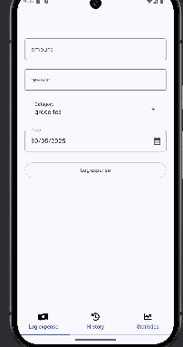

# expensesApp

is a mobile application that provides an intuitive and user-friendly interface for 
managing expenses using a RESTful backend API. 
Built with Android Studio and Jetpack Compose (Kotlin), 
the app aims to deliver a clean and modern user experience.

## Features
- View, add, edit, and delete expense entries

- Sync data with a backend REST API in https://github.com/DianisRod/expensesBackend

- Clean and responsive UI with Jetpack Compose

- Support for categories, date filtering, and totals (if implemented)

## Technologies Used
- Kotlin
- Jetpack Compose
- Android Studio
- Retrofit / Ktor (library for API calls)

